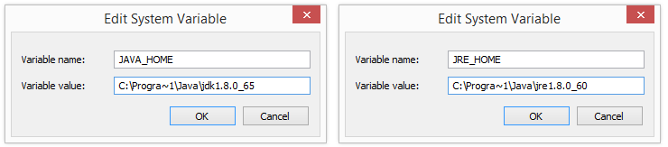

# Karate Framework

- [Karate Framework](#karate-framework)
  - [1. O que é o Karate Framework](#1-o-que-é-o-karate-framework)
    - [1.1. Funcionalidades do Karate](#11-funcionalidades-do-karate)
    - [1.2. Exemplo de teste com Karate](#12-exemplo-de-teste-com-karate)
  - [2. Instalação](#2-instalação)
    - [2.1. Instalação do Java](#21-instalação-do-java)
      - [*2.1.1.* Passo a passo de download](#211-passo-a-passo-de-download)
      - [*2.1.2.* Configuração de variáveis de ambiente no Windows](#212-configuração-de-variáveis-de-ambiente-no-windows)
      - [*2.1.3.* Testando a configuração](#213-testando-a-configuração)
    - [2.2. Standalone Karate Framework](#22-standalone-karate-framework)
  - [3. Entendendo o Karate](#3-entendendo-o-karate)
    - [3.1. Karate Framework e Gherkin](#31-karate-framework-e-gherkin)
    - [3.2. DSL para HTTP](#32-dsl-para-http)
      - [*3.2.1.* url](#321-url)
      - [*3.2.2.* path](#322-path)
      - [*3.2.3.* param](#323-param)
      - [*3.2.4.* header](#324-header)
      - [*3.2.5.* form field](#325-form-field)
      - [*3.2.6.* multipart](#326-multipart)
      - [*3.2.7.* cookie](#327-cookie)
      - [*3.2.8.*  request](#328--request)
      - [*3.2.9.* method](#329-method)
      - [*3.2.10.* status](#3210-status)
  - [4. Criando testes](#4-criando-testes)
  - [5. Dicionário](#5-dicionário)
  - [6. Referências](#6-referências)
## 1. O que é o Karate Framework

``Karate`` é um *framework open-source* que possibilita a criação de testes de **API**.

O ``Karate`` utilize parte da sintaxe do Gherkin, muito popular na escrita de documentos BDD, o que possibilita que os testes sejam legíveis mesmo para pessoas **não familiarizadas** com programação.

[Documentação oficial Karate Framework](https://github.com/karatelabs/karate)

### 1.1. Funcionalidades do Karate

1. Utiliza alguns padrões do Gherkin;
2. Não requer obrigatoriamente conhecimento de alguma linguagem de programação;
3. Permite que testes sejam executados em paralelo por padrão;
4. Debug de testes;
5. Reutilização de scripts de teste;
6. Suporte para execução de testes orientados a dados (DDT - *Data Driven Tests*);
7. Relatório integrado que não requer configuração;
8. Permite a configuração de diferentes ambientes de teste;

### 1.2. Exemplo de teste com Karate

Abaixo temos o exemplo de um teste que verifica se uma chamada HTTP GET para a rota ```http://crud-api-academy.herokuapp.com/api/v1/users``` retorna response code ``200``.

```gherkin
Feature: Consulta de usuários
    Como uma pessoa qualquer
    Desejo consultar todos os usuários cadastrados
    Para ter as informações de todos os usuários

Scenario: Consultar todos os usuários
    Given url "http://crud-api-academy.herokuapp.com/api/v1"
    And path "users"
    When method get
    Then status 200
```

## 2. Instalação

### 2.1. Instalação do Java

O Java é um pré-requisito para utilização do Karate, já que o framework é compilado em Java.

#### *2.1.1.* Passo a passo de download

1. Acessar a página de [Download](https://www.oracle.com/br/java/technologies/javase/javase8-archive-downloads.html) do Java 8;
2. Na lista de download ``Java SE Development Kit 8u202`` localize a versão que mais condiz com o sistema operacional de seu computador pessoal. O mais comum será ``Windows x86`` ou ``Windows x64``;
3. Siga as instruções de download na página;
4. Execute o programa que foi baixado e siga as instruções. ``Obs: Se atente ao local de instalação do programa pois ele será utilizado futuramente.``

#### *2.1.2.* Configuração de variáveis de ambiente no Windows

1. Acesse o menu de pesquisa do Windows;
2. Pesquise por ``Variáveis de ambiente``;
3. Acesse a opção ``Editar Variáveis de ambiente do sistema``;
4. No canto inferior direito, acesse ``Variáveis de ambiente``;
5. Em ``Variáveis do sistema``, clique em ``Novo``;
6. No campo ``Nome da variável``, insira ``JAVA_HOME``; 
7. No campo ``Valor da variável``, insira o seu caminho de instalação do Java.

||
|:--:| 
| *Exemplo de configuração da variável JAVA_HOME* | 

8. Em ``Variáveis de usuário``, localize a variável ``Path``;
9. Clique em ``Editar``;
10. Clique em ``Novo`` para adicionar uma nova linha;
11. Acrescente na nova linha o seguinte: ``%JAVA_HOME%\bin``


#### *2.1.3.* Testando a configuração

1. Caso possua um terminal aberto, encerre-o;
2. Abra o Prompt de comando;
3. Escreva o comando ``echo %JAVA_HOME%``. O prompt deverá exibir o local de instalação do Java;
4. Escreva o comando ``java -version``. O prompt deverá exibir a versão do Java que está instalada em seu computador.

### 2.2. Standalone Karate Framework

É possível realizar a "instalação" do Karate através do download de um arquivo executável Java (``.jar``).

1. Acesse a página de [Releases do Karate](https://github.com/karatelabs/karate/releases);
2. Procure pela última ``release`` (versão) disponível contendo a tag ``Latest``, que significa ``Mais recente`` em Português;
3. Acesse a grade de ``Assets``;
4. Faça download do arquivo ``karate-1.2.0.RC1.jar``. ``Obs:`` Atente-se ao fato que o número da versão pode mudar;

Com o ``standalone`` baixado, você poderá executar o Karate, mas para isso será necessário criar um ou mais arquivos de teste. Veremos isso em seguida.

## 3. Entendendo o Karate

### 3.1. Karate Framework e Gherkin

O Karate Framework permite que criemos teste utilizando elementos da sintaxe Gherkin. Tais elementos são:

1. ``Feature``;
2. ``Scenario`` e ``Scenario Outline``;
3. ``Background``;
4. Steps: ``Given, When, Then, And``;
5. ``Tables``;
6. ``Examples``;

### 3.2. DSL para HTTP

O Karate possui uma ``DSL`` própria que permite a configuração e envio de requisições HTTP. Além disso, também podemos fazer uso da sintaxe ``JSON`` diretamente em sua estrutura de testes, sem utilizar caracteres especiais para demarcar conteúdo JSON.


Veremos nos capítulos a seguir as principais ``Keywords`` do Karate Framework:

#### *3.2.1.* url

Utilizada para configurar a URL da requisição;

```gherkin
Given url "https://crud-api-academy.herokuapp.com/api/v1"
```

#### *3.2.2.* path

Permite a configuração de ``path parameters``, como os utilizados em [GET /users/{id}](https://crud-api-academy.herokuapp.com/api-docs/#/Users/get_users__id_).

```gherkin
Given path "users"
And path 1
# path resultante = /users/1
```

```gherkin
Given path "users"
And path id 
# path resultante = /users/id
```

```gherkin
Given path "users", id 
# path resultante = /users/id
```

#### *3.2.3.* param

Permite a configuração de ``query params``;

Os caracteres especiais utilizados serão convertidos para o formato [Url Encoded](https://www.w3schools.com/tags/ref_urlencode.asp).

```gherkin
Given param chave = "sua chave"
# url resultante = ?chave=1
```

```gherkin
Given param value = "aluno academy"
# url resultante = ?value=aluno%20academy
```

```gherkin
Given param value = ["aluno academy", "estudante"]
# url resultante = ?value=aluno%20academy&value=estudante
```

#### *3.2.4.* header

Permite a configuração dos ``headers``;

```gherkin
Given header id = 12512312
```

```gherkin
Given header ativo = false
```

```gherkin
Given header token = "bearer L8qq9PZyRg6ieKGEKhZolGC0vJWLw8iEJ88DRdyOg"
```

```gherkin
Given headers { id:  "12512312", name: "aluno" } 
```

#### *3.2.5.* form field

Permite a configuração de payload no formato URL encoded.

```gherkin
Given form field usuario = "aluno"
And form field senha = "senhaAluno"
```

```gherkin
Given form fields { usuario: "aluno", senha: "senhaAluno" } 
```

#### *3.2.6.* multipart

Permite a configuração de parâmetros multipart.

```gherkin
Given multipart field mensagem = "Olá mundo"
```

```gherkin
Given multipart file { usuario: "aluno", senha: "senhaAluno" } 
```

#### *3.2.7.* cookie

Permite a configuração de cookies.

```gherkin
Given cookie pesquisa = "playstation 5"
```

```gherkin
Given cookies { pesquisa: "playstation 5", marca: "sony" } 
```

#### *3.2.8.*  request

Permite a configuração do request body que será enviado para a requisição HTTP. 

Este payload pode ser um ``JSON`` ou ``XML``.

```gherkin
Given request { name: "User Name", email: "user@example.com" }
```

```gherkin
Given request read("payloadCriacaoUsuario.json")
```

```gherkin
* def payload = { name: "User Name", email: "user@example.com" }
Given request payload
```

#### *3.2.9.* method

Permite a configuração do método ou verbo HTTP (GET, POST, PUT, DELETE, PATCH, etc.).

Quando o verbo HTTP é configurado, a requisição é imediatamente enviada pelo Karate Framework. Portanto, todas as configurações da requisição (URL e parâmetros) devem ser feitas antes da configuração do verbo HTTP.

```gherkin
When method get
```

```gherkin
When method post
```

```gherkin
When method put
```

```gherkin
When method delete
```

```gherkin
When method patch
```

#### *3.2.10.* status

Permite o teste do response code. Se a verificação considerar que o response code retornado pela requisição não condiz com o especificado no teste, o teste irá falhar.

```gherkin
Then status 200
```

```gherkin
Then status 201
```

```gherkin
Then status 400
```

## 4. Criando testes

Os testes do Karate devem ser criados através de arquivos ``.feature``, a mesma extensão de arquivo utilizado para escrever Gherkin.

A documentação do teste também seguirá o mesmo padrão utilizado em Gherkin:

1. Definição da Funcionalidade;
2. Definição de Contexto da funcionalidade;
3. Definição do Cenário de teste;
4. Definição dos steps do teste.

**Exemplo de cenário de teste de uma funcionalidade:**

```gherkin
# Definição da funcionalidade
Feature: Controle de Pets no PetShop
    Como um cliente do PetShop
    Desejo gerenciar os Pets
    Para ter controle das informações registradas na plataforma

    # Contexto compartilhado entre todos os cenários
    Background: Base url
        # Configuração do baseUrl da API
        Given url "https://petstore.swagger.io/v2"

    # Cenário de teste de cadastro de Pet
    Scenario: Deve ser possível cadastrar um novo Pet
        # Configuração da rota
        Given path "pet"
        # Configuração do Request Body em JSON
        And request
        """
        {
            "id": 0,
            "category": {
                "id": 0,
                "name": "string"
            },
            "name": "doggie",
            "photoUrls": [
                "string"
            ],
            "tags": [
                {
                "id": 0,
                "name": "string"
                }
            ],
            "status": "available"
        }
        """
        # Configuração do verbo HTTP
        When method post
        # Teste que verifica se o response code é igual a 200
        Then status 200
```

## 5. Dicionário

1. **Framework:** ferramenta;
2. **Open source:** código livre;
3. **DSL:** Domain Specific Language;
4. **Data Driven Tests:** Testes Orientados a Dados;
5. **Release:** versão;
6. **Latest:** mais recente;
7. **Feature:** funcionalidade;
8. **Scenario:** cenário;
9. **Scenario outline:** esquema de cenário;
10. **Given:** dado;
11. **When:** quando;
12. **Then:** então;
13. **And:** e;
14. **Background:** contexto;
15. **Table:** tabela;
16. **Examples:** exemplos.

## 6. Referências

[Documentação Karate](https://github.com/karatelabs/karate)

[Configurando variável JAVA_HOME no Windows](https://confluence.atlassian.com/confbr1/configurando-a-variavel-java_home-no-windows-933709538.html)

[API testing with Karate Framework](https://www.softwaretestinghelp.com/api-testing-with-karate-framework/)